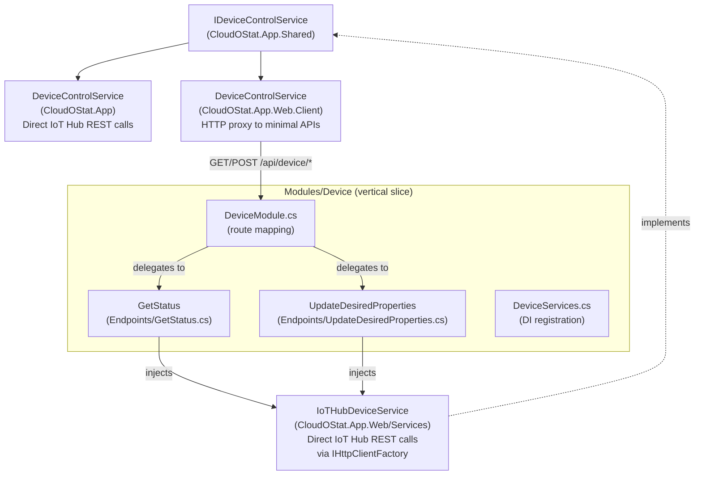

# IoT Hub Authentication & Device Control

## Overview
The app communicates with Azure IoT Hub via its REST API to read device twin reported properties (temperatures, status) and write desired properties (telemetry interval). Authentication uses **SAS tokens** generated from a shared access policy key.

## SAS Token Generation
Tokens are generated locally using HMAC-SHA256 over the hub URI and expiry timestamp:

```csharp
var encodedResourceUri = Uri.EscapeDataString(iotHubUri);
var expiryTime = DateTimeOffset.UtcNow.AddMinutes(60).ToUnixTimeSeconds();
var signatureString = $"{encodedResourceUri}\n{expiryTime}";
// HMAC-SHA256 sign with policy key, then base64 encode
return $"sr={encodedResourceUri}&sig={signature}&se={expiryTime}&skn={policyName}";
```

Key parameters:
- **Resource URI**: Hub-level (`{hubName}.azure-devices.net`) — not device-scoped, since the REST API calls are service-level operations.
- **`skn`**: The shared access policy name (read from `IoTHub:SharedAccessKeyName` config, defaults to `iothubowner`). Must match the policy the key belongs to — a mismatch causes 401 Unauthorized.
- **Expiry**: 60 minutes from generation.
- **Authorization header**: Callers prepend `SharedAccessSignature ` to the token string — the token itself must NOT include this prefix.

## Configuration
All IoT Hub settings live under the `IoTHub` section in `appsettings.json` or environment variables:

| Key | Description | Example |
|---|---|---|
| `IoTHub:HubName` | IoT Hub name (without `.azure-devices.net`) | `usw-iot-cloudostat` |
| `IoTHub:DeviceId` | Target device identity | `cloudostat-meadow` |
| `IoTHub:SharedAccessKey` | Base64-encoded policy key | *(secret)* |
| `IoTHub:SharedAccessKeyName` | Shared access policy name | `iothubowner` |

The Aspire AppHost injects all four values as environment variables into the web project via `WithEnvironment()`. The policy name is sourced from the `IoTHubPolicyName` Aspire parameter and mapped to `IoTHub__SharedAccessKeyName`.

### Required Policy Permissions
The shared access policy used must have these permissions:
- **Registry Read** — required for `GET /twins/{deviceId}` (reading device twin)
- **Registry Write** — required for `PATCH /twins/{deviceId}/properties/desired` (updating desired properties)
- **Service Connect** — required for cloud-to-device operations

The built-in `service` policy only has Service Connect and will return **401 Unauthorized** for twin operations. Use a custom policy or `iothubowner` (dev only).

## Three IDeviceControlService Implementations



### Vertical Slice Structure
```
CloudOStat.App.Web/
├── Modules/
│   └── Device/
│       ├── Endpoints/
│       │   ├── GetStatus.cs          ← one class per operation
│       │   └── UpdateDesiredProperties.cs
│       ├── DeviceModule.cs           ← route mapping (MapDeviceEndpoints)
│       └── DeviceServices.cs         ← DI registration (RegisterDeviceServices)
└── Services/
    └── IoTHubDeviceService.cs        ← IoT Hub REST API communication
```

- **MAUI** (`CloudOStat.App/Services/DeviceControlService.cs`): Calls IoT Hub REST API directly using `HttpClient` + SAS token.
- **Web Server** (`CloudOStat.App.Web/Services/IoTHubDeviceService.cs`): Implements `IDeviceControlService`. Calls IoT Hub REST API via `IHttpClientFactory`. Registered as singleton.
- **Web Endpoints** (`CloudOStat.App.Web/Modules/Device/Endpoints/`): One handler class per operation — `GetStatus` and `UpdateDesiredProperties`. Each is a plain class with constructor injection of `IoTHubDeviceService`. Nested records for commands/DTOs.
- **Device Module** (`CloudOStat.App.Web/Modules/Device/DeviceModule.cs`): `MapDeviceEndpoints` extension maps routes under `/api/device` and delegates to handler classes.
- **Device Services** (`CloudOStat.App.Web/Modules/Device/DeviceServices.cs`): `RegisterDeviceServices` extension registers `IoTHubDeviceService`, `IHttpClientFactory`, and endpoint handlers.
- **WebAssembly** (`CloudOStat.App.Web.Client/Services/DeviceControlService.cs`): HTTP proxy — calls `/api/device/status` and `/api/device/twin/desired` on the web server.

## Device Status Model

### `DeviceOperationalStatus` enum (`IDeviceControlService.cs`)
Typed representation of what the Meadow device reports in the `device_status` twin property:

| Enum value | Maps from raw string | Meaning |
|---|---|---|
| `Heating` | `"Heating"` | Heater relay active; temp below setpoint |
| `OnTemp` | `"On Temp"` | At setpoint; relay off |
| `Over` | `"Over"` | Above setpoint; relay off |
| `Offline` | *(stale twin)* | No update within 10 minutes |
| `Error` | any other string | Sensor/comms error message |
| `Unknown` | `null` / empty | No data yet |

### `DeviceStatus.StatusKind` property
Computed via `DeviceStatus.ParseStatusKind(raw, isConnected)`. Always set by the service
implementations (both Web and MAUI); the WASM client receives it pre-computed via JSON.

### `DeviceStatus.IsConnected`
Derived from `LastUpdate` staleness — `true` only if the twin reported within the last **10 minutes**
(`StaleDeviceThreshold = TimeSpan.FromMinutes(10)` in both service implementations).
Previously hardcoded to `true`.


| Operation | HTTP Method | IoT Hub URL |
|---|---|---|
| Get device twin | `GET` | `https://{hub}.azure-devices.net/twins/{deviceId}?api-version=2021-04-12` |
| Update desired props | `PATCH` | `https://{hub}.azure-devices.net/twins/{deviceId}/properties/desired?api-version=2021-04-12` |

## Telemetry Interval Constraints
- Minimum: **5 seconds**
- Maximum: **300 seconds** (5 minutes)
- Validated on both client and server before sending to IoT Hub.

## Related Files
- [../practices.md](../practices.md) — DI registration pattern for each host
- [../hardware/sensors-and-control.md](../hardware/sensors-and-control.md) — Meadow-side sensor reading and IoT Hub MQTT connection
