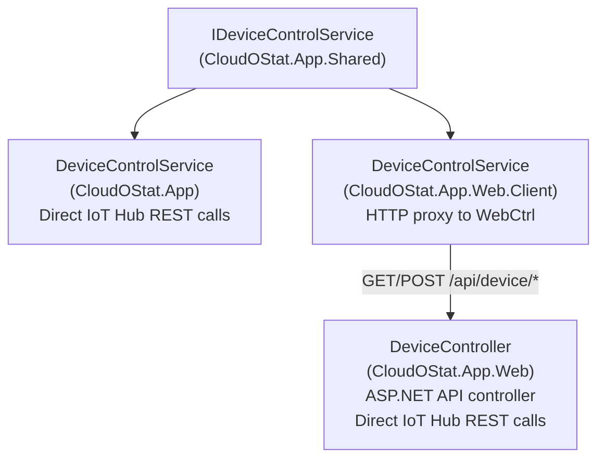

# IoT Hub Authentication & Device Control

## Overview
The app communicates with Azure IoT Hub via its REST API to read device twin reported properties (temperatures, status) and write desired properties (telemetry interval). Authentication uses **SAS tokens** generated from a shared access policy key.

## SAS Token Generation
Tokens are generated locally using HMAC-SHA256 over the hub URI and expiry timestamp:

```csharp
var encodedResourceUri = Uri.EscapeDataString(iotHubUri);
var expiryTime = DateTimeOffset.UtcNow.AddMinutes(60).ToUnixTimeSeconds();
var signatureString = $"{encodedResourceUri}\n{expiryTime}";
// HMAC-SHA256 sign with policy key, then base64 encode
return $"sr={encodedResourceUri}&sig={signature}&se={expiryTime}&skn={policyName}";
```

Key parameters:
- **Resource URI**: Hub-level (`{hubName}.azure-devices.net`) — not device-scoped, since the REST API calls are service-level operations.
- **`skn`**: The shared access policy name (read from `IoTHub:SharedAccessKeyName` config, defaults to `iothubowner`). Must match the policy the key belongs to — a mismatch causes 401 Unauthorized.
- **Expiry**: 60 minutes from generation.
- **Authorization header**: Callers prepend `SharedAccessSignature ` to the token string — the token itself must NOT include this prefix.

## Configuration
All IoT Hub settings live under the `IoTHub` section in `appsettings.json` or environment variables:

| Key | Description | Example |
|---|---|---|
| `IoTHub:HubName` | IoT Hub name (without `.azure-devices.net`) | `usw-iot-cloudostat` |
| `IoTHub:DeviceId` | Target device identity | `cloudostat-meadow` |
| `IoTHub:SharedAccessKey` | Base64-encoded policy key | *(secret)* |
| `IoTHub:SharedAccessKeyName` | Shared access policy name | `iothubowner` |

The Aspire AppHost injects all four values as environment variables into the web project via `WithEnvironment()`. The policy name is sourced from the `IoTHubPolicyName` Aspire parameter and mapped to `IoTHub__SharedAccessKeyName`.

### Required Policy Permissions
The shared access policy used must have these permissions:
- **Registry Read** — required for `GET /twins/{deviceId}` (reading device twin)
- **Registry Write** — required for `PATCH /twins/{deviceId}/properties/desired` (updating desired properties)
- **Service Connect** — required for cloud-to-device operations

The built-in `service` policy only has Service Connect and will return **401 Unauthorized** for twin operations. Use a custom policy or `iothubowner` (dev only).

## Three IDeviceControlService Implementations



- **MAUI** (`CloudOStat.App/Services/DeviceControlService.cs`): Calls IoT Hub REST API directly using `HttpClient` + SAS token.
- **Web Server** (`CloudOStat.App.Web/Controllers/DeviceController.cs`): ASP.NET controller that calls IoT Hub REST API directly. Serves as the backend for WebAssembly clients.
- **WebAssembly** (`CloudOStat.App.Web.Client/Services/DeviceControlService.cs`): HTTP proxy — calls `/api/device/status` and `/api/device/twin/desired` on the web server. Cannot call IoT Hub directly from the browser.

## REST API Endpoints Used

| Operation | HTTP Method | IoT Hub URL |
|---|---|---|
| Get device twin | `GET` | `https://{hub}.azure-devices.net/twins/{deviceId}?api-version=2021-04-12` |
| Update desired props | `PATCH` | `https://{hub}.azure-devices.net/twins/{deviceId}/properties/desired?api-version=2021-04-12` |

## Telemetry Interval Constraints
- Minimum: **5 seconds**
- Maximum: **300 seconds** (5 minutes)
- Validated on both client and server before sending to IoT Hub.

## Related Files
- [../practices.md](../practices.md) — DI registration pattern for each host
- [../hardware/sensors-and-control.md](../hardware/sensors-and-control.md) — Meadow-side sensor reading and IoT Hub MQTT connection
