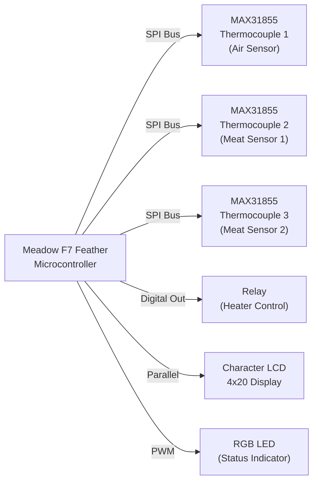

# Hardware Integration & Sensors

CloudOStat monitors three temperature sensors and controls a heater relay via a Meadow F7 Feather microcontroller.

## Hardware Stack



## Core Interfaces & Implementation

**IHardwarePackage** (abstraction):
```csharp
public interface IHardwarePackage
{
    IMAX31855 AirSensor { get; }
    IMAX31855 MeatSensor1 { get; }
    IMAX31855 MeatSensor2 { get; }
    IDigitalOutputPort HeaterRelay { get; }
    ITextDisplay Display { get; }
    IRgbPwmLed OnboardLed { get; }
}
```

**HardwarePackage** (Meadow F7 concrete implementation):
- Initializes SPI bus for thermocouple amplifiers
- Creates digital output port for relay
- Configures character LCD (4 rows × 20 columns)
- Sets up onboard RGB LED

## Thermocouple Driver

**IMAX31855** / **MAX31855**:
- K-type thermocouple amplifier over SPI
- Reads temperature from three sensor probes
- Abstracts SPI protocol details

Pins used (Meadow F7):
- **Air Sensor**: D00 (CS)
- **Meat Sensor 1**: D01 (CS)
- **Meat Sensor 2**: D02 (CS)
- **Shared**: SPI bus (clock, MOSI, MISO)

## Relay Control

**HeaterRelay** (IDigitalOutputPort):
- Pin: D11 (Meadow F7)
- Toggles auxiliary heating element on/off
- Discrete high/low control (no PWM)

## Local Display

**CharacterDisplay** (ITextDisplay):
- 4 rows × 20 columns LCD
- Pins: D05–D10 (RS, E, D4–D7 for 4-bit parallel mode)
- Real-time sensor readout on device

## Status Indicator

**OnboardLed** (IRgbPwmLed):
- RGB LED for system status feedback
- Can display: heating (red-orange), cooling (blue), on-temp (green), error (red)

## Integration Pattern

1. **CloudOStat.Common** defines abstraction (`IHardwarePackage`)
2. **HardwarePackage.cs** implements for Meadow F7
3. **Device projects** instantiate and register in DI:
   ```csharp
   services.AddSingleton<IHardwarePackage>(
       new HardwarePackage(meadowDevice)
   );
   ```
4. **UI/Dashboard** injects and reads sensor values, controls relay

## Sensor Reading Model

Each sensor returns:
- Temperature (°C or °F, user-configurable)
- Timestamp
- Status (heating, cooling, on-temp, error)

Dashboard displays:
- Current temperature (large, primary)
- Target temperature (user-set)
- Status indicator (color + icon)
- Historical mini-chart (optional)

## Relay Control Logic

1. **User sets target temperature** in Settings/Dashboard
2. **Background service/thread** polls sensors periodically
3. **PID or simple hysteresis** logic decides relay state
4. **Relay toggles** via `HeaterRelay.State = high/low`
5. **LED & LCD display** current state

Future: async relay commands from Dashboard.

---

See [practices.md](../practices.md) for DI setup; [lode-map.md](../lode-map.md) for file locations.
