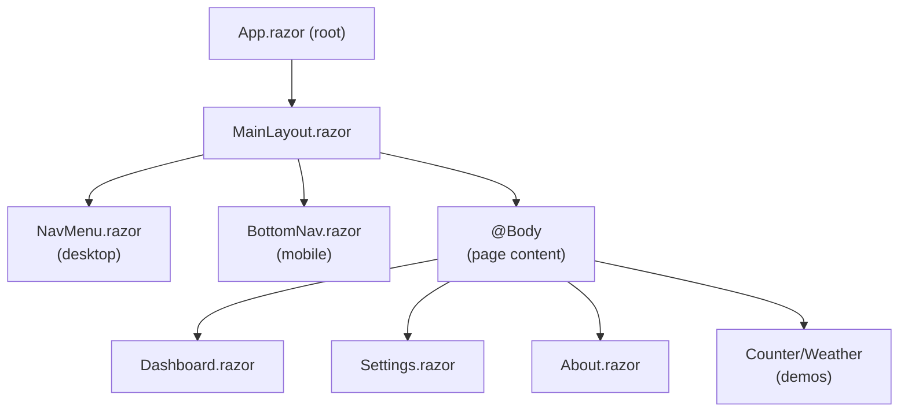

# UI Architecture & Component Model

CloudOStat uses a shared Razor component library (`CloudOStat.App.Shared`) hosted by two independent hosts: MAUI (desktop/mobile) and Blazor Web (server + WASM). All UI lives in Shared; hosts only register services and configure entry points.

## Component Hierarchy



## Responsive Logic

**MainLayout.razor.cs** detects platform via `IFormFactor`:
```csharp
bool IsDesktop => _formFactor?.IsDesktop ?? false;
bool IsMobile => _formFactor?.IsMobile ?? false;
```

**MainLayout.razor** conditionally renders:
- **Desktop**: NavMenu sidebar + full-width body
- **Mobile**: BottomNav tab bar + body below

CSS breakpoints (MudBlazor + app.css) adjust spacing, font sizes, margins.

## Styling Strategy

| Scope | File(s) | Use Case |
|-------|---------|----------|
| **Global** | `app.css` | Colors, fonts, utility classes used across all components |
| **Component** | `*.razor.css` | Scoped styles (MainLayout, BottomNav, etc.) |
| **Inline** | Style attributes in `.razor` | One-off, logic-dependent styles (rare) |

**Key Global Styles**:
- CSS variables for theme colors (inherited from MudBlazor provider)
- Safe-area padding for mobile (e.g., `padding-top: env(safe-area-inset-top)`)
- Breakpoints: `@media (max-width: 960px)` for mobile toggle

## Theme Integration

**MudTheme** (from `CloudOStatTheme.cs`) wraps all components:
```csharp
<MudThemeProvider Theme="CloudOStatTheme.SmokerEmber" IsDarkMode="isDarkMode" />
```

This provides:
- Color palette variables (primary, secondary, accent, etc.)
- Material Design component styling
- Light/dark mode switching

Components use MudBlazor classes (`mud-*`) and CSS variables (`--mud-palette-primary`) for consistent theming.

## Form Factor & Platform Abstraction

**IFormFactor** (interface):
```csharp
public interface IFormFactor
{
    bool IsDesktop { get; }
    bool IsMobile { get; }
    bool IsTablet { get; }
}
```

**Platform Implementations**:
- **MAUI**: `FormFactor` reads device size + orientation
- **Blazor Web**: `FormFactor` reads viewport width from JS interop
- **WASM**: Similar to Web

Injected into `MainLayout` for responsive behavior.

## Navigation & Route Management

**NavigationService** defines routes:
```csharp
public IReadOnlyList<NavItem> PrimaryNav =>
[
    new NavItem("Home", Icons.Material.Filled.Home, "/", true),
    new NavItem("Dashboard", Icons.Material.Filled.Dashboard, "/dashboard"),
    new NavItem("Settings", Icons.Material.Filled.Settings, "/settings")
];

public void Navigate(string route) => _navigationManager.NavigateTo(route);
```

**NavMenu.razor** loops through service routes:
```razor
@foreach (var item in NavigationService.PrimaryNav)
{
    <NavLink href="@item.Route" Match="@(item.MatchAll ? NavLinkMatch.All : NavLinkMatch.Prefix)">
        <MudIcon Icon="@item.Icon" />
        @item.Label
    </NavLink>
}
```

**BottomNav.razor** renders as MudTabs (mobile-optimized).

## Layout Responsive Behavior

**Desktop** (>= 960px):
- NavMenu: fixed left sidebar
- Body: full-width with left margin
- BottomNav: hidden

**Mobile** (< 960px):
- NavMenu: hidden
- BottomNav: fixed bottom tabs
- Body: full-width above BottomNav

CSS media queries and `IsDesktop`/`IsMobile` conditional rendering handle the switch.

## Component Imports & Global Using

**_Imports.razor** (in Shared):
```razor
@using CloudOStat.App.Shared
@using CloudOStat.App.Shared.Layout
@using CloudOStat.App.Shared.Services
@using CloudOStat.App.Shared.Theme
@using MudBlazor
```

All shared components and services available in Shared components without explicit `@using`.

Host projects (_Imports.razor) extend with platform-specific imports.

## Pages & Features

| Page | Purpose | Status |
|------|---------|--------|
| `Dashboard` | Real-time sensor monitoring, relay control | Core feature |
| `Settings` | Configuration (thresholds, units, etc.) | Core feature |
| `About` | App version, credits, links | Status page |
| `Counter` | Demo: stateful component | Demo/test |
| `Weather` | Demo: async data fetch | Demo/test |

Pages use `@page "/route"` directive; automatically routed by Blazor.

---

See [practices.md](practices.md) for dependency injection details; [lode-map.md](lode-map.md) for file structure.
