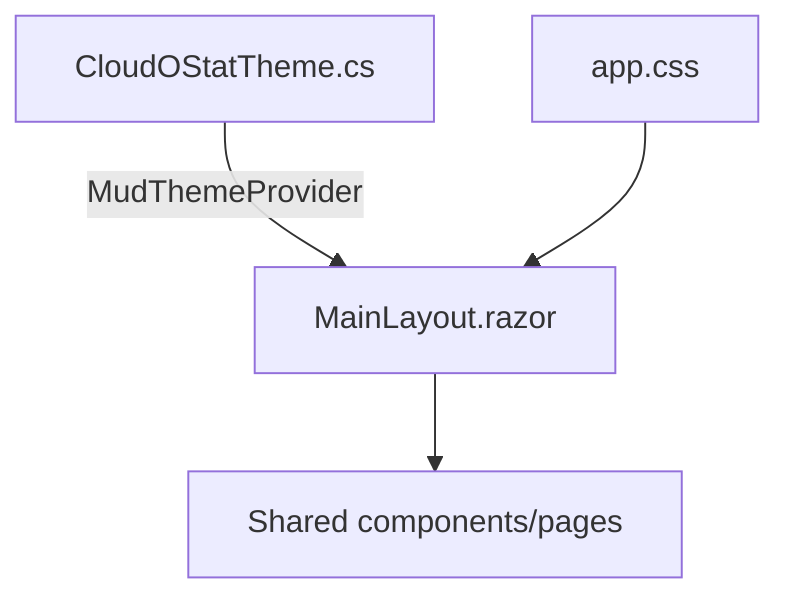

# CloudOStat UI Architecture

## Component hierarchy, responsive design, theming, error handling, and platform abstraction

Related:
- [../practices.md](../practices.md)
- [../summary.md](../summary.md)

### Overview
CloudOStat uses a shared Razor component library (`CloudOStat.App.Shared`) consumed by both MAUI (`CloudOStat.App`) and Blazor WebAssembly/Server (`CloudOStat.App.Web` + `.Web.Client`). This enables write-once UI with platform-specific hosting.


```mermaid
flowchart TD
    Theme[CloudOStatTheme.cs] -->|MudThemeProvider| Layout[MainLayout.razor]
    Css[app.css] --> Layout
    Layout --> Components[Shared components/pages]
```

---

## Component Structure

### Layout Components
- **MainLayout.razor/cs**: Root layout with responsive drawer, app bar, and error boundary
  - Uses MudBlazor's `MudLayout`, `MudAppBar`, `MudDrawer`, `MudMainContent`
  - Toggles between desktop (persistent drawer) and mobile (temporary drawer + bottom nav)
  - Wraps entire layout in `ErrorBoundary` for Blazor rendering error recovery
- **NavMenu.razor**: Navigation list for drawer
  - Drawer links use `IconColor="Color.Inherit"` so icons match the drawer text color defined by the active MudBlazor theme
- **BottomNav.razor**: Mobile-only bottom navigation bar (hidden on desktop/tablet)

### Pages
- **Dashboard.razor**: Main dashboard view
- **Settings.razor**: Application settings
- **About.razor**: About page

### Responsive Behavior
Handled via MudBlazor's `MudBreakpointProvider`:
- **Mobile** (`< Breakpoint.Md`): No drawer, bottom nav visible, no hamburger menu
- **Tablet/Desktop** (`>= Breakpoint.Md`): Mini drawer (icon bar) by default, hamburger expands to full width, no bottom nav

#### Drawer Behavior by Breakpoint

**Mobile (< Breakpoint.Md):**
- Drawer is completely hidden (not rendered)
- Hamburger button is hidden
- BottomNav provides navigation
- `_isMobile = true`, `_drawerOpen = false`

**Tablet/Desktop (≥ Breakpoint.Md):**
- Drawer uses `DrawerVariant.Mini`
- Always visible in mini state (icon bar) by default
- Hamburger button toggles between mini and expanded states
- `_drawerOpen = false` → Mini state (icons only)
- `_drawerOpen = true` → Expanded state (full width with labels)
- No bottom navigation

#### Implementation Details

**MainLayout.razor.cs:**
```csharp
// Default state: Mini drawer for tablet/desktop
protected DrawerVariant _drawerVariant = DrawerVariant.Mini;

private void UpdateLayout(Breakpoint breakpoint)
{
    _isMobile = breakpoint < Breakpoint.Md;
    _isDesktop = breakpoint >= Breakpoint.Lg;

    if (_isMobile)
    {
        // Mobile: No drawer rendered
        _drawerOpen = false;
        return;
    }

    // Tablet/Desktop: Mini variant
    // Open=false shows mini bar, Open=true expands full width
    _drawerVariant = DrawerVariant.Mini;
}
```

**MainLayout.razor:**
```razor
<MudAppBar Color="Color.Default" Elevation="1">
    @if (!_isMobile)
    {
        <MudIconButton Icon="@Icons.Material.Filled.Menu" Color="Color.Primary" ... />
    }
    <MudText Color="Color.Primary" Typo="Typo.h6">CloudOStat</MudText>
</MudAppBar>

@if (!_isMobile)
{
    <MudDrawer @bind-Open="_drawerOpen"
               Variant="_drawerVariant"
               ClipMode="DrawerClipMode.Always">
        <NavMenu />
    </MudDrawer>
}

@if (_isMobile)
{
    <BottomNav />
}
```

**Key Design Decision:**
- `ClipMode="DrawerClipMode.Always"` ensures drawer clips under AppBar and content adjusts properly
- Mini variant with `Open` property provides seamless toggle between mini/expanded without layout shifts
- Conditional rendering (`@if (!_isMobile)`) prevents drawer from being in DOM on mobile devices

---

## Error Handling

### Three-Layer Strategy

#### 1. MAUI Global Exception Handlers (App.xaml.cs)
Catches unhandled exceptions at the application level:
- `AppDomain.CurrentDomain.UnhandledException` – Synchronous unhandled exceptions
- `TaskScheduler.UnobservedTaskException` – Async exceptions that escape try/catch

**Behavior:**
- Logs exception details to debug output
- Displays user-friendly alert dialog with error message
- Allows app to continue running when possible

```csharp
private void OnUnhandledException(object sender, UnhandledExceptionEventArgs e)
{
    if (e.ExceptionObject is Exception ex)
    {
        LogException(ex, "Unhandled Exception");
        MainThread.BeginInvokeOnMainThread(async () =>
        {
            await ShowErrorDialogAsync(ex);
        });
    }
}
```

#### 2. Blazor ErrorBoundary Component (MainLayout.razor)
Catches component rendering errors within Blazor:
- Wraps the entire `MudLayout` in `<ErrorBoundary>`
- Provides custom `<ErrorContent>` UI with:
  - User-friendly error message
  - "Try Again" button to recover without reload
  - "Show Details" toggle for stack trace
  - Styled error panel using MudBlazor components

**Recovery:**
- User clicks "Try Again" → calls `_errorBoundary?.Recover()` → re-renders component tree
- Falls back to standard Blazor error UI if boundary fails

#### 3. Debug Logging (MauiProgram.cs)
Enhanced logging configuration:
- Debug builds: `LogLevel.Debug` with `AddDebug()` and developer tools
- Release builds: `LogLevel.Warning` to reduce noise
- Filtered logging for noisy Blazor internals

---

## MudBlazor Static Assets in MAUI

### Critical Configuration
MAUI projects require explicit MudBlazor static asset references in `wwwroot/index.html`:

```html
<!-- Required MudBlazor assets -->
<link rel="stylesheet" href="_content/MudBlazor/MudBlazor.min.css" />
<script src="_content/MudBlazor/MudBlazor.min.js"></script>
```

### Common Issue: mudElementRef.getBoundingClientRect undefined
**Symptom:** `JSException: Could not find 'mudElementRef.getBoundingClientRect' ('mudElementRef' was undefined)`

**Root Cause:** Missing `MudBlazor.min.js` in MAUI's `index.html`. Without this script, MudBlazor's JavaScript interop library never loads, causing `mudElementRef` to be undefined when components try to call JavaScript methods.

**Solution:** Add both MudBlazor CSS and JS references to `CloudOStat.App/wwwroot/index.html`:
- `MudBlazor.min.css` – Required for styling
- `MudBlazor.min.js` – Required for JSInterop functionality (getBoundingClientRect, resize observers, etc.)

**Affected Components:**
- `MudDrawer` – Height calculations and clip mode
- `MudNavGroup` – Collapse/expand animations  
- `MudCollapse` – Animated height transitions
- `MudBreakpointProvider` – Resize event handling

**Note:** The web project (`App.razor`) includes these by default, but MAUI projects must add them manually.

---

## Theming

### MudBlazor Theme System
- **CloudOStatTheme.cs**: Defines custom themes with typography, palette, shadows
- **MudThemeProvider**: Applied in MainLayout.razor (current default: `CloudOStatTheme.SmokerEmber`)
- **CSS files**:
  - `app.css` (global): Site-wide styles, mobile safe-area adjustments, **CRT glow effects**
  - `MainLayout.razor.css`, `BottomNav.razor.css` (scoped): Component-specific styles

### Available Themes

#### SmokerEmber
Warm, amber/orange palette inspired by classic smoker barbecue:
- **Primary**: Smoked Ember (#B33F1C)
- **Secondary**: Charred Oak (#5A2E1A)
- **Accent**: Glazed Honey (#F2A65A)
- **Background**: Ash White (#F7F3EE)
- **Status**: Heating (Active Flame), Cooling (Cooling Ash), OnTemp (Herb Green)

#### BackyardPitmaster
Cool steel tones with seasoned wood accents:
- **Primary**: Smoker Steel (#2F3E46)
- **Secondary**: Cold Smoke (#354F52)
- **Accent**: Seasoned Wood (#DDA15E)
- **Background**: Canvas Tan (#EAE7DC)
- **Status**: Heating (Glowing Coals), Cooling (Cool Steel Blue), OnTemp (Olive Green)

#### TemperatureGradient
Dynamic gradient from cool to warm zones:
- **Primary**: Warm Zone (#F4A261)
- **Secondary**: Cool Zone (#1B4965)
- **Accent**: Hot Zone (#E76F51)
- **Background**: Neutral (#F1FAEE)
- **Status**: Heating (Rising Heat), Cooling (Falling Cool), OnTemp (Balanced Teal)

#### FarmhouseModern
Earthy, sage and clay palette:
- **Primary**: Sage Smoke (#6B705C)
- **Secondary**: Clay (#CB997E)
- **Accent**: Butcher Paper (#DDBEA9)
- **Background**: Warm Neutral (#FFE8D6)
- **Status**: Heating (Warm Terracotta), Cooling (Cool Sage Gray), OnTemp (Soft Balanced Green)

#### CRT80sNeon ✨
Classic 1980s movie computer interface (WarGames/Tron style):
- **Primary**: Phosphor Green (#00FF00) – Classic CRT terminal glow
- **Secondary**: Neon Cyan (#00FFFF) – WarGames/Tron aesthetic
- **Accent**: Hot Magenta (#FF00FF) – Neon glow effect
- **Background**: Deep Space Black (#0A0E27) – CRT scan black with blue tint
- **Surfaces**: Dark Navy (#0F1535) – Subtle depth
- **Typography**: Monospace (Courier New/Monaco) – Authentic terminal feel
- **Status**:
  - Heating: Hot Magenta-Red (#FF0055) – Intense, danger glow
  - Cooling: Bright Cyan (#00FFFF) – Icy, system calm
  - OnTemp: Bright Green (#00FF00) – Stable, nominal
  - Warning: Bright Yellow (#FFFF00) – Maximum visibility
  - Error: Neon Red (#FF1111) – Critical danger
- **Design**: Minimal border radius (2px), high contrast, bright neon on dark background, authentic CRT aesthetic with monospace typography throughout

#### BeamPenetrationVector
Vector display theme with a deep-black background and phosphor-blue text accents:
- **Primary**: Beam Blue (#4DA3FF)
- **Secondary**: Beam Yellow (#FFD24D)
- **Accent**: Beam Orange (#FF9A3D)
- **Background**: Deep Black (#050505)

**app.css (vector styling):**
```css
.vector-beam-display .mud-appbar {
    background-color: var(--vector-beam-background);
}

.vector-glow-text {
    color: var(--vector-beam-blue);
    text-shadow:
        0 0 3px var(--vector-beam-blue),
        0 0 8px rgba(77, 163, 255, 0.7),
        0 0 14px rgba(77, 163, 255, 0.5),
        0 0 22px rgba(77, 163, 255, 0.35);
}
```

### CRT Phosphor Glow Effects
When using the **CRT80sNeon** theme, text can opt into glowing phosphor effects via CSS text-shadows in `app.css`:

**Available CSS Classes:**
- `.crt-glow-text` – Green glow (default, used on main content)
- `.crt-glow-text-cyan` – Cyan glow (for secondary text/accents)
- `.crt-glow-text-magenta` – Magenta glow (for warnings/highlights)
- `.crt-glow-pulse` – Animated pulsing glow (add to any element for breathing effect)

**Technical Details:**
- Uses multi-layer `text-shadow` to create authentic phosphor green glow
- Base glow layers: 3px, 8px, 15px, 25px for depth and luminosity
- CSS variables (`--crt-glow-green`, `--crt-glow-cyan`, `--crt-glow-magenta`) enable easy customization
- Applied selectively via class usage

**Example Usage:**
```html
<!-- Green glow (default) -->
<MudText Class="crt-glow-text">Normal text with glow</MudText>

<!-- Cyan glow for accent text -->
<MudText Class="crt-glow-text-cyan">Important system message</MudText>
```

### Beam-Penetration Vector Effects
The **BeamPenetrationVector** theme applies vector-specific effects via `app.css`:

**Effects:**
- **Phosphor bloom** via layered white text-shadows
- **Beam-dwell artifacts** via subtle horizontal offset shadows
- **No scanlines** (vector displays are beam-driven, not raster)
- **Outline-only surfaces** (transparent fills + yellow outlines)

**Available CSS Classes:**
- `.vector-beam-display` – Root class applied on `MudLayout`
- `.vector-glow-text` – Extra bloom for titles and focal labels
- `.vector-beam-blue`, `.vector-beam-yellow`, `.vector-beam-orange`, `.vector-beam-red` – Beam-penetration color accents
- `.vector-outline-surface` – Optional outline-only container helper

**Example Usage:**
```html
<MudText Class="vector-glow-text">Vector headline</MudText>
<MudText Class="vector-beam-yellow">Locked at 225°F</MudText>
<MudPaper Class="vector-outline-surface">Outlined panel</MudPaper>
```

### Styling Guidelines
**Prefer MudBlazor's theming system over custom CSS:**
- Use `CloudOStatTheme.cs` to define colors, typography, spacing, shadows, and component defaults
- Rely on MudBlazor's built-in component styling and utility classes (`mud-px-4`, `mud-mt-2`, etc.)
- Only create custom CSS when:
  - MudBlazor explicitly recommends it (e.g., scoped styles for layout-specific adjustments)
  - Platform-specific requirements (e.g., mobile safe-area handling)
  - Global styles not covered by MudBlazor's theme system (e.g., CRT glow effects)

**Rationale:** MudBlazor's theme engine ensures consistent styling, automatic dark mode support, and easier maintenance. Custom CSS can conflict with theme updates and requires manual dark mode handling.
